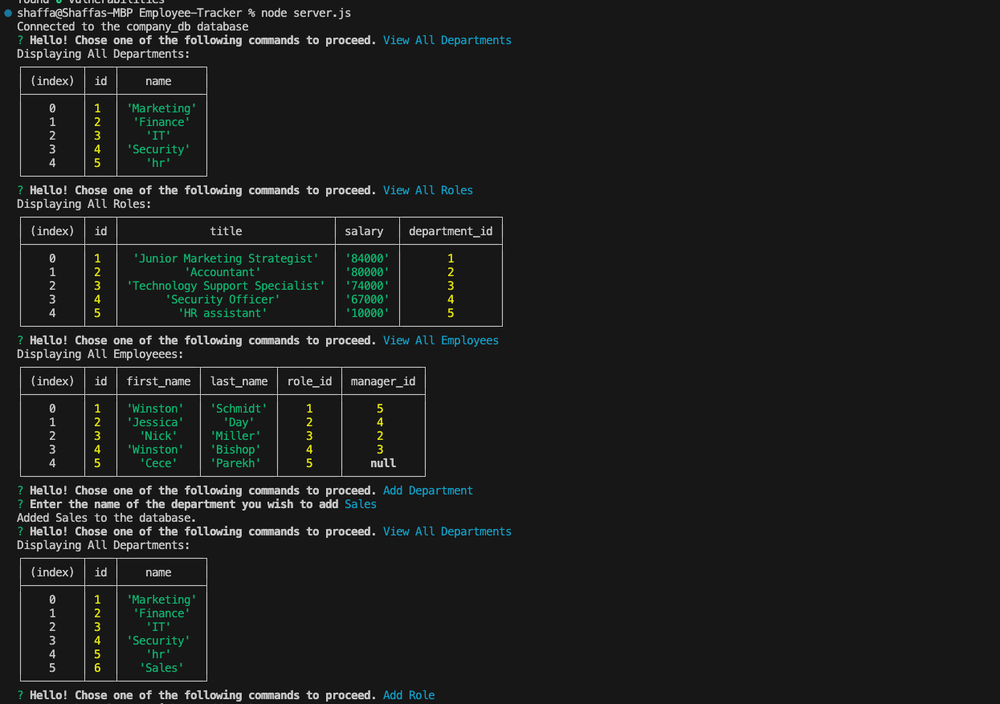
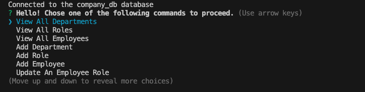

# Employee Tracker
## Module 12: SQL

## Walkthrough Video Link 
https://drive.google.com/file/d/1QiGvPnPyJAU7EGqsZIq5UAm3fBgK9MR2/view

## GITHUB Repository Link
https://github.com/shaffachaudhry/Employee-Tracker

## Table of Contents
- [Table of Contents](#table-of-contents)
- [Description](#description)
- [Usage](#usage)
- [Mock Image](#mock-image)
- [Installation](#installation)
- [License](#license)
- [Contributors](#contributors)
- [Tests](#tests)
- [Questions](#questions)

## Description
The application provides a platform to overview and manage a company's departments, roles, and employees for efficient and easy organization. 

## Mock Image

## Usage 
Begin the CLI with the command `node server.js`. The CLI will prompt a series of questionswith either choices or options to provide input based on the prompt. Please follow the instructions provided as the CLI proceeds.

## Installation 
The user  must clone the repository onto their local drive. To begin the CLI, one must first ensure all dependencies and packages are installed such as inquirer using `npm i inquirer@8.2.4`. The user must also install mySQL2 and run an npm install. The User then must run `mysql -u root -p` to begin MySQL. Run `SOURCE db/schema.sql` followed by `db/seeds.sql`. Quit mySQL and begin the CLI with the command `node server.js`. 

## License 
This project is covered under the MIT license.

## Contributors
I am the sole contributor of this project. However, this project was built with the help of in class modules, specifically the Student Mini Project. Additional links that were helpful linked below: 
https://www.npmjs.com/package/mysql2?activeTab=readme
https://www.npmjs.com/package/validate
https://developer.mozilla.org/en-US/docs/Web/JavaScript/Reference/Global_Objects/Array/push

## Tests 
N/A

## Questions 
For any additional questions or information, please contact me, additionally, feel free to view my other projects: 
- Github: [shaffachaudhry](https://github.com/shaffachaudhry)